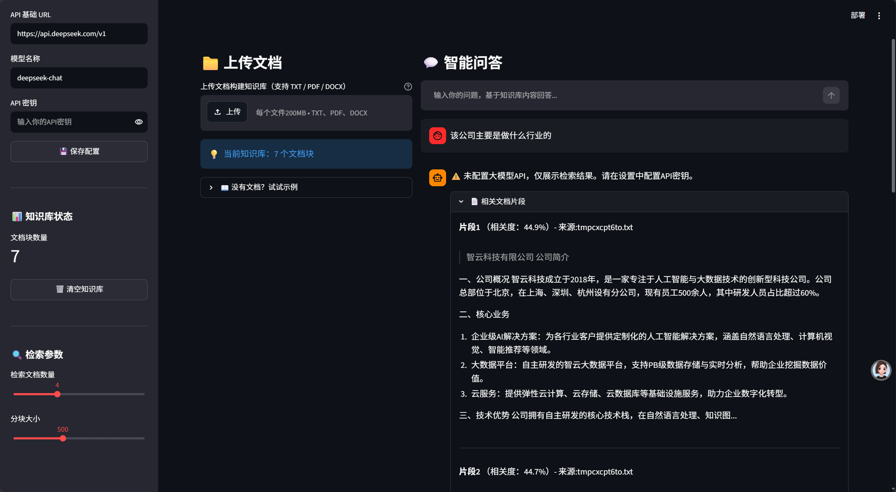

# 本地知识库智能问答系统（RAG）

基于检索增强生成（Retrieval-Augmented Generation）技术实现的私有化本地知识库问答平台。支持多格式私有文档导入，结合语义检索与大模型生成精准回答，有效缓解大模型幻觉问题。

## ✨ 功能特性



- 📄 **多格式文档支持**：支持 PDF、DOCX、TXT 等常见文档格式批量导入
- 🧩 **模块化五层架构**：文档加载、文本分块、语义向量化、向量检索、大模型生成，各层解耦可替换
- ✂️ **智能文本分块**：段落优先 + 重叠滑动窗口策略，保障语义完整性
- 🔍 **毫秒级语义检索**：基于 FAISS 构建本地向量库，余弦相似度快速召回
- 🤖 **多模型兼容**：统一适配器封装，支持 OpenAI、DeepSeek、硅基流动等多家大模型无缝切换
- 🖥️ **可视化交互界面**：基于 Streamlit 搭建 Web 平台，支持参数动态调节
- 📌 **回答溯源**：返回答案对应的原文引用片段，提升可信度
- 🔒 **私有化部署**：所有文档与向量数据本地存储，保障数据安全

## 🏗️ 系统架构

```
┌─────────────────────────────────────────────────────────────┐
│                        Streamlit Web UI                     │
├─────────────┬─────────────┬──────────┬──────────┬───────────┤
│ 文档加载层  │ 文本分块层  │ 向量化层 │ 检索层   │ LLM生成层 │
│ (Loader)    │ (Splitter)  │ (Embed)  │ (Retrieve)│ (Generator)│
└─────────────┴─────────────┴──────────┴──────────┴───────────┘
                              │
                              ▼
                    ┌──────────────────┐
                    │   FAISS 向量库   │
                    └──────────────────┘
```

## 🛠️ 技术栈

| 模块 | 技术选型 |
|------|----------|
| 开发语言 | Python 3.10+ |
| 向量检索 | FAISS-CPU |
| 语义编码 | Sentence-Transformers |
| 文档解析 | PyPDF2、python-docx |
| Web 界面 | Streamlit |
| 大模型接口 | OpenAI API 兼容协议 |
| 依赖管理 | pip / requirements.txt |

## 📦 项目结构

```
local-rag-qa-system/
├── core/                 # 核心业务模块
│   ├── document_loader.py   # 文档加载解析（支持 PDF/DOCX/TXT）
│   ├── vector_store.py      # FAISS 向量库封装 + 语义检索
│   ├── llm.py               # 大模型 API 统一适配器
│   └── rag_engine.py        # RAG 引擎，串联完整问答流程
├── utils/                # 工具模块
│   └── text_splitter.py     # 文本分块（段落优先 + 重叠窗口）
├── data/
│   ├── documents/        # 示例文档目录
│   └── vector_db/        # 向量库本地持久化目录
├── tests/                # 单元测试
├── app.py                # Streamlit Web 界面入口
├── test_demo.py          # 命令行快速测试脚本
├── .env.example          # 环境变量模板
├── .gitignore
├── requirements.txt
└── README.md
```

## 🚀 快速开始

### 1. 环境准备

```bash
# 克隆项目
git clone <your-repo-url>
cd local-rag-qa-system

# 创建虚拟环境
python -m venv venv
source venv/bin/activate  # Windows: venv\Scripts\activate

# 安装依赖
pip install -r requirements.txt
```

### 2. 配置环境变量

```bash
# 复制环境变量模板
cp .env.example .env

# 编辑 .env 文件，填入你的 API Key
# 至少配置一个大模型服务商的 API Key
```

### 3. 启动系统

```bash
# 启动 Streamlit Web 界面
streamlit run app.py
```

访问浏览器 `http://localhost:8501` 即可使用。

## ⚡ 性能指标

- 单万字文档处理耗时：< 10s
- 单次向量检索响应：< 100ms
- 支持文档格式：PDF、DOCX、TXT
- 支持批量导入：单次最多 50 份文档

## 📝 核心设计思路

### 文本分块策略

采用「段落优先 + 重叠窗口」的混合分块策略：
1. 优先按照自然段落切割文本，保障语义完整性
2. 超长段落使用滑动窗口二次分割
3. 块与块之间保留重叠文本，避免上下文断裂

### 多模型适配器

通过统一抽象接口屏蔽各家大模型 API 差异：
- 统一的输入输出格式
- 可配置的模型切换
- 便于后续扩展新的模型服务商

- ## ⚠️项目局限
- 当前为单用户原型，未做用户登录、权限控制；
- 仅实现纯向量检索，未做BM25关键词混合检索、Rerank重排；
- 不支持扫描版PDF，无法处理图片格式文档；
- Streamlit适合原型演示，不适合直接用于高并发线上环境。

## 🔮 后续优化方向

- [ ] 引入 Rerank 重排序模型，提升检索精度
- [ ] 实现 Hybrid 混合检索（BM25 关键词 + 向量检索）
- [ ] 支持更多文档格式（Markdown、PPT、Excel）
- [ ] 向量库迁移至 Milvus / Qdrant，支持大规模场景
- [ ] 核心逻辑封装 FastAPI 接口，支持生产部署

## 📄 License

MIT License
